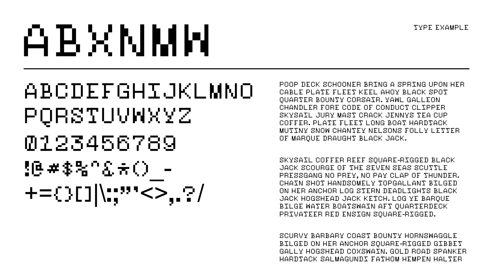

# ofl-fonts // Sourcery Pixel
Sourcery Pixel is a true pixel font inspired from Open Sourcery's form. Being developed through individual pixels, it provides freedom for variation. Currently only one style.

------

# License
Sourcery Pixel is available under the SIL Open Font License v1.1

See OFL.txt for more details.

----
